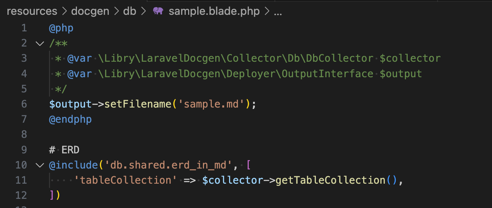
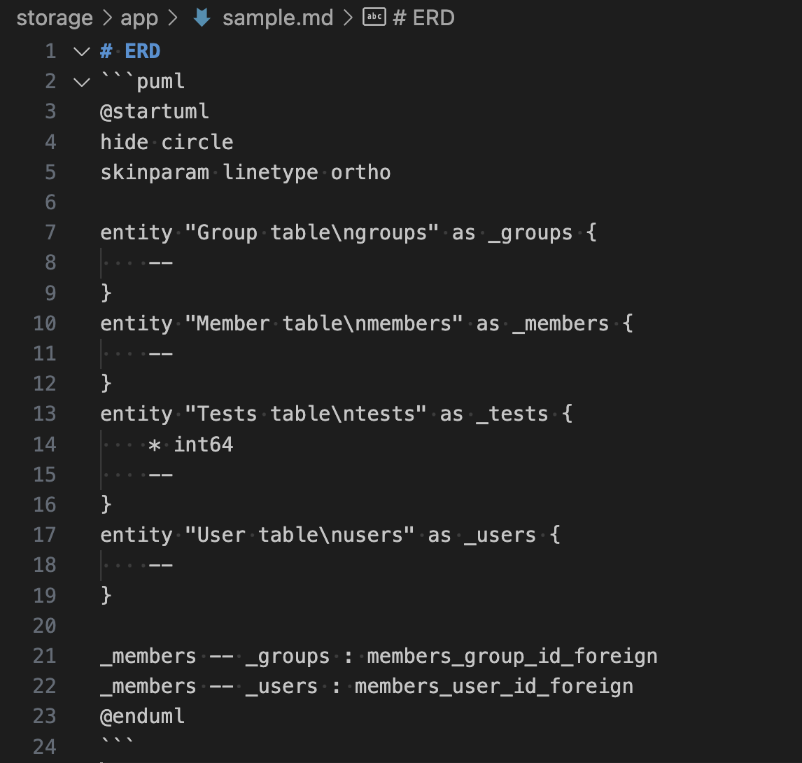

# What's laravel-docgen - Laravel Document Generator
This is a library that helps you almost automatically generate documents with data gathered from like a DB schema.
This library uses Laravel but your application doesn't necessarily need to.
You can edit the output with Blade PHP, like below:

↓


# Installation
```sh
composer require --dev libry-inc/laravel-docgen
artisan vendor:publish --tag=laravel-docgen
```

# Usage
## Publish and generate a sample document
```sh
artisan vendor:publish --tag=laravel-docgen.sample
artisan laravel-docgen db.sample
```

## Customize
- To change I/O directions, modify config/laravel-docgen.php
- To change outputs, modify resources/docgen/...

# Contributions
## Install
```sh
docker buildx bake
docker compose up -d
docker compose exec php composer install
```

## Pre-commit
```sh
docker compose exec php composer fixer
```
